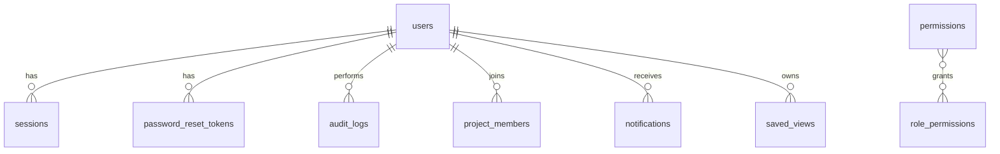
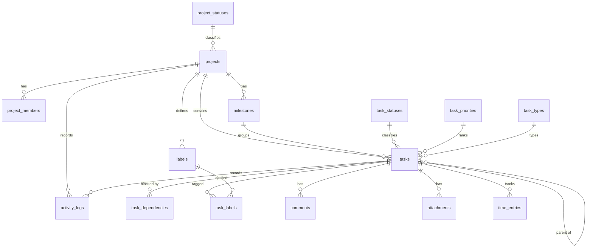

# Project Tracker — Architecture & Implementation Plan

**Status:** All eight phases implemented — authentication, users, roles, projects, tasks, Kanban, collaboration, dependencies, scheduling, analytics, audit log, spreadsheet import/export, production Docker configuration and the full documentation set. See `README.md` for setup and `docs/` for the API, database and security references.
**Version:** 1.0
**Reference artifact analyzed:** Google Sheet `1d1CpW1M-xOiH6-Qr1GhcOzaKdvshfCZCBVMYJ5W0ON4`, sheet `Tracker` (`gid=345523772`)

This document is the single source of truth for requirements, data model, API surface, frontend structure, security posture, infrastructure, testing and phasing. Implementation starts **after approval** of this document, phase by phase, with previously working functionality kept green.

---

## Table of contents

1. [Spreadsheet reference analysis](#1-spreadsheet-reference-analysis)
2. [Product requirements summary](#2-product-requirements-summary)
3. [Roles and permission model](#3-roles-and-permission-model)
4. [Assumptions, decisions and open questions](#4-assumptions-decisions-and-open-questions)
5. [System architecture](#5-system-architecture)
6. [Database design](#6-database-design)
7. [Backend API architecture](#7-backend-api-architecture)
8. [Authorization and IDOR/BOLA defense](#8-authorization-and-idorbolla-defense)
9. [Frontend architecture](#9-frontend-architecture)
10. [Security plan](#10-security-plan)
11. [Infrastructure: Docker, env, HTTPS](#11-infrastructure-docker-env-https)
12. [Testing strategy](#12-testing-strategy)
13. [Spreadsheet import/export and migration](#13-spreadsheet-importexport-and-migration)
14. [Implementation phases and acceptance criteria](#14-implementation-phases-and-acceptance-criteria)
15. [Deliverables checklist](#15-deliverables-checklist)
16. [Approval checklist](#16-approval-checklist)

---

## 1. Spreadsheet reference analysis

### 1.1 What the sheet actually contains

The spreadsheet was exported and parsed (`export?format=csv&gid=345523772`). It has a single visible sheet named **Tracker**.

**Structure**

```
Row 1-3 : title block + usage instruction
Row 5-6 : KPI summary row
Row 8   : header row
Row 9+  : 31 data rows (one task per row)
```

**KPI row**

| Total tasks | Completed | Blocked | Overdue | Due next 7 days | Completion |
|---|---|---|---|---|---|
| 31 | 23 | 0 | 0 | 0 | 74% |

**Columns**

| Column | Meaning | Observations |
|---|---|---|
| `Area` | Functional area / component | 13 distinct values: Meetings, Calendar, Notifications, School Profile, Tables/UI, Email & Proposals, Demo, AI Research, Export, Terminology, Automation, Universe. **1 row has no Area.** This is the de-facto grouping/project dimension. |
| `Task` | Task title | Free text, sometimes long, sentence-style ("Table dropdowns become pop-ups that update instantly on click"). |
| `Owner` | Assignee | **Empty for all 31 rows.** No user data to migrate. |
| `Priority` | Priority | Medium (19), High (5), Low (7). No `Critical` used. |
| `Status` | Status | `Done` (23), `To do` (5), `In progress` (3). Free text, inconsistent casing; only 3 of the 8 statuses the app needs. |
| `Due date` | Due date | **Empty for all 31 rows.** |
| `Completed date` | Completion date | **Empty for all 31 rows**, including 23 rows marked `Done`. |
| `Blocker / next step` | Mixed field | 18 rows populated. Mixes two concepts: verification notes (`Verified`, `-`, empty) and real blockers/next steps (`Column exists but has no data source...`, `Only exact substring now...`, `No export on ...`). |
| `Reference link` | Code reference | 29 rows populated. **Not URLs** — they are code locations like `Universe.jsx:55-68; school.service.js:266-274`, `modals.jsx:408-410,874-875`, `rules.js:1425-1443`. One row uses `-`. |

**Sample rows (verbatim, abbreviated)**

| Area | Task | Priority | Status | Blocker / next step | Reference link |
|---|---|---|---|---|---|
| (empty) | Add Completed Meetings summary card (values hidden by default, shown in table on card click) | Medium | Done | | `Universe.jsx:55-68; school.service.js:266-274` |
| Calendar | Block picking past dates/times when scheduling a meeting | High | Done | Verified | `modals.jsx:408-410,874-875` |
| AI Research | Show Product Matching % in Products and Opportunities | High | In progress | Column exists but has no data source (always "—"); populate matching_pct server-side | `components.jsx:228,747` |
| Automation | Run Not Started: auto-send email when researched | High | To do | No researched-to-send path | — |
| Email & Proposals | Remove email attachments (spam risk) | High | Done | Stop attaching the sample PDF in the Send Proposal payload | `email-proposal.service.js:1296-1298` |

### 1.2 Structural weaknesses the web app must fix

1. **Flat list, no project entity.** `Area` is the only grouping and it is free text, not validated.
2. **No stable task identity.** Tasks are referenced by title; no `DEV-142`-style key exists.
3. **No relational links.** No parent/subtask, no dependencies, no milestone, no labels beyond `Area`.
4. **Mixed-meaning columns.** `Blocker / next step` holds verification notes *and* work-plan notes. `Reference link` holds code references, not links.
5. **Neutralized status/priority vocabularies.** Only 3 statuses and 3 priorities in use; values are free text, so counters and sorting break silently.
6. **KPI block is hand-maintained**, not derived (74% was computed by hand).
7. **No assignment, no dates, no history, no comments, no audit trail.** Ownership is a blank column.
8. **Code references are unstructured** — one cell can contain multiple `file:line` pairs separated by `;` and `,`.

### 1.3 Migration implications (decisions taken)

| Spreadsheet artifact | Target model | Rule |
|---|---|---|
| Whole sheet | One project `Web App Development` with code `WEBAPP` (admin can instead split by Area — see [open question Q1](#4-assumptions-decisions-and-open-questions)) | Migrated as a batch, idempotent, dry-run first |
| `Area` | `labels` row (global label), attached via `task_labels` | Label auto-created, normalized (trim, collapse spaces) |
| `Task` | `tasks.title` | Imported verbatim; a short `description` is optional |
| `Owner` (empty) | `tasks.assignee_id = NULL` | Import supports a populated owner column via mapping + name/email resolution |
| `Priority` | `task_priorities` by case-insensitive name | `High/Medium/Low` mapped; unknown values → import error row, never silently dropped |
| `Status` | `task_statuses` by case-insensitive name | `To do → TODO`, `In progress → IN_PROGRESS`, `Done → DONE` |
| `Due date` (empty) | `tasks.due_date = NULL` | No fake dates generated |
| `Completed date` (empty, but status `Done`) | `tasks.completed_at = migration timestamp` | Flagged in import report so users can correct |
| `Blocker / next step` | Split: values `Verified` / `-` / empty → `tasks.verification_note`; everything else → `tasks.next_step` (text, visible as "Blocker / Next step") | Also offered as candidate `task_dependencies` during preview |
| `Reference link` | `tasks.code_references` (text[], one entry per `file:line` pair, parsed on `;`) + optional per-entry `url` when the value is an actual URL | Displayed in a dedicated "Code references" panel |
| KPI row / title block | Ignored (derived statistics replace it) | Detected and skipped during import |

---

## 2. Product requirements summary

### 2.1 Goal

A centralized, secure, internal project tracker for software teams that replaces the spreadsheet and adds: real users/roles, projects, tasks/subtasks, milestones, dependencies, Kanban, calendar/timeline, filters/search, comments, activity history, notifications, workload, analytics, audit log, attachments, import/export.

### 2.2 In scope (v1)

- Auth: login, logout, admin-created users, optional self-registration (flag), password reset, session expiry, lockout.
- RBAC with 4 global roles + per-project membership roles, enforced **server-side** on every resource.
- Projects: CRUD, archive (no hard delete from UI), members, tags/labels, milestones, statuses/priorities/types configuration.
- Tasks: CRUD, subtasks (nesting depth ≤ 2), status/priority/type/assignee/reporter, dates, estimate/actual hours, progress, labels, code references, next step, dependencies with cycle prevention.
- Views: Board (Kanban, accessible drag & drop), List/Table, Calendar (month/week), Timeline (Gantt-style), task detail page/modal, My Tasks, Team workload, Reports/analytics, Notifications, Settings, Admin (users, vocabularies, audit log, import).
- Comments with `@mentions`, activity feed per task/project, in-app notifications with read/unread.
- Attachments with type/size validation and authorized download.
- Audit log for security-relevant events (append-only).
- CSV/XLSX import with mapping → preview → validation → commit; CSV export.
- Saved views, task templates, recurring task definitions (generation job).

### 2.3 Out of scope (v1, designed for later)

- Multi-tenancy / organizations.
- Real-time collaboration (WebSocket presence). TanStack Query polling + invalidation is used instead.
- Email/SMS/push delivery (adapter interface provided; dev writes to a mail-outbox table).
- Full-text search engine (v1 uses PostgreSQL `pg_trgm` + `ILIKE`).
- S3 storage (v1 uses local volume behind a `StorageProvider` interface).
- Redis-backed distributed rate limiting (v1 in-process; interface documented for scale-out).

---

## 3. Roles and permission model

### 3.1 Two-level RBAC

1. **Global role** (`users.global_role`) — account-wide capability: `ADMIN`, `PROJECT_MANAGER`, `DEVELOPER`, `VIEWER`.
2. **Project role** (`project_members.project_role`) — optional per-project override: `MANAGER`, `DEVELOPER`, `VIEWER`.

Effective project permission = **maximum of (global role capabilities, project membership role capabilities)**. `ADMIN` is always maximum everywhere. A global `VIEWER` can be explicitly made `DEVELOPER` on one project by an admin/manager — that is an intentional grant, never self-service.

### 3.2 Permission keys

| Domain | Keys |
|---|---|
| Project | `project:view`, `project:create`, `project:update`, `project:archive`, `project:delete`, `project:manage_members`, `project:manage_milestones`, `project:manage_labels`, `project:manage_settings` |
| Task | `task:view`, `task:create`, `task:update`, `task:update_status`, `task:assign`, `task:delete`, `task:manage_dependencies`, `task:manage_time` |
| Collaboration | `comment:create`, `comment:update_own`, `comment:moderate`, `attachment:upload`, `attachment:download`, `attachment:delete_own`, `attachment:moderate` |
| Insight | `report:view`, `workload:view` |
| Admin | `user:manage`, `role:manage`, `vocabulary:manage`, `audit:view`, `import:run`, `export:run`, `settings:manage` |

### 3.3 Permission matrix

| Permission | Admin | Project Manager | Developer | Viewer |
|---|---|---|---|---|
| `project:view` | all | own/managed | member | member |
| `project:create` | ✅ | ✅ | ❌ | ❌ |
| `project:update` / `archive` | ✅ | managed projects | ❌ | ❌ |
| `project:delete` (hard) | ✅ | ❌ | ❌ | ❌ |
| `project:manage_members` / `settings` / `milestones` / `labels` | ✅ | managed projects | ❌ | ❌ |
| `task:view` | all | managed | member | member |
| `task:create` | ✅ | ✅ | ✅ | ❌ |
| `task:update` | ✅ | ✅ | ✅ (any task in member project) | ❌ |
| `task:update_status` | ✅ | ✅ | ✅ | ❌ |
| `task:assign` | ✅ | ✅ | ❌ (may self-assign) | ❌ |
| `task:delete` | ✅ | ✅ | ❌ | ❌ |
| `task:manage_dependencies` | ✅ | ✅ | ✅ | ❌ |
| `task:manage_time` | ✅ | ✅ | ✅ (own entries) | ❌ |
| `comment:create` | ✅ | ✅ | ✅ | ❌ |
| `comment:update_own` | ✅ | ✅ | ✅ | — |
| `comment:moderate` (delete any) | ✅ | ✅ | ❌ | ❌ |
| `attachment:upload` | ✅ | ✅ | ✅ | ❌ |
| `attachment:download` | ✅ | ✅ | ✅ | ✅ |
| `report:view` / `workload:view` | ✅ | ✅ | ✅ (own projects) | ✅ (own projects) |
| `user:manage` / `role:manage` / `vocabulary:manage` / `settings:manage` / `audit:view` / `import:run` | ✅ | ❌ | ❌ | ❌ |

All checks run in a central authorization service (see [§8](#8-authorization-and-idorbolla-defense)). Frontend hiding is UX only, never a security boundary.

---

## 4. Assumptions, decisions and open questions

### 4.1 Decisions made (override with a comment if needed)

| # | Decision | Rationale |
|---|---|---|
| D1 | **Opaque session cookie** auth (DB-stored hashed session tokens) instead of JWT | Spec allows either; sessions give instant revocation, simple logout, and no token-in-localStorage risk |
| D2 | **Argon2id** password hashing (`m=19456 KiB, t=2, p=1`) | Stronger than bcrypt; fallback bcrypt only if the container's native build fails |
| D3 | **PostgreSQL enums avoided for user-editable vocabularies**; statuses/priorities/types are lookup **tables** with a stable `key` + `category` | Spec requires configurable statuses; `category` keeps workflow logic stable even if labels change |
| D4 | **Postgres enums used only for fixed infrastructure values** (`audit_action`, `import_status`, etc.) | These are not user-configurable |
| D5 | **Soft delete** (`deleted_at`) for users, projects, tasks, comments, attachments; hard delete only via explicit admin purge | Spec: archive instead of delete; audit safety |
| D6 | **Task keys** are per-project: `projects.code` + `projects.task_sequence`; canonical key `DEV-142`. Subtask display alias `DEV-142-1` is computed from child order and is **presentational**; every task keeps its own project-wide key | Stable references, simple numbering, no collisions |
| D7 | **Progress rules:** task with subtasks → derived from subtask completion (cancelled excluded); task without subtasks → manual `progress` unless status becomes `done` (→ 100) or `cancelled`; project/milestone progress → average of active task progress (cancelled/archived excluded), cached in `projects.progress` and recomputed in the same transaction as task mutations | Predictable, explainable, cheap to query |
| D8 | **Overdue** = `due_date < current_date` and status category ∉ {`done`, `cancelled`}. **Blocked** = status category `blocked` **or** has at least one dependency whose status category ∉ {`done`, `cancelled`}; the UI shows these as separate badges ("Blocked" / "Waiting on DEV-101") | Matches how the sheet used "Blocker" as text but should be enforced |
| D9 | **404 for invisible resources, 403 for visible-but-forbidden actions** | Prevents existence enumeration (IDOR mitigation) |
| D10 | **Public registration disabled by default** (`ENABLE_PUBLIC_REGISTRATION=false`); admins create users. First admin is created by seed script from env | Internal tooling; avoids open signup |
| D11 | **Attachments are never served from a public static path**; downloads go through an authorized API route with `Content-Disposition` and `nosniff` | Prevents unauthenticated access and stored-XSS via HTML/SVG |
| D12 | **API is same-origin** behind the web container's reverse proxy; CORS allowlist exists only for local dev tools | Fewer failure modes, cookies work cleanly |
| D13 | **`code_references` stored as `text[]`**, parsed from the sheet; optional URL detection | Preserves the existing workflow without inventing a table for it |
| D14 | **Dates:** `timestamptz` for timestamps, `date` for due/start/target dates; all API I/O in ISO-8601 UTC; UI renders in the user's configured timezone (default `Asia/Manila`) | Sheet explicitly relied on Asia/Manila |
| D15 | **Optimistic concurrency** on tasks via `version int`: `PATCH` sends `version`; mismatch → `409 CONFLICT` | Prevents lost updates on Kanban drag races |
| D16 | **Import is two-phase** (`PREVIEW` rows stored → explicit `COMMIT`), idempotent via a content hash per row and a `import_jobs` record | Spec: preview, validate, show errors, confirm |

### 4.2 Open questions (defaults chosen; confirm to override)

| # | Question | Default if no answer |
|---|---|---|
| Q1 | Should the sheet migrate into **one project with Areas as labels**, or **one project per Area** (13 projects)? | One project `WEBAPP`, Areas as labels — preserves the current tracking unit and keeps the migration reversible |
| Q2 | Is `Critical` priority expected in the seed data? | Seed all four priorities (Critical/High/Medium/Low); only the three from the sheet are used on imported rows |
| Q3 | Do you need **story points** as well as hours? | Hours only in v1; `story_points` column is a documented, nullable follow-up (not created now, to avoid dead schema) |
| Q4 | Should attachments be enabled by default? | Yes, local volume, 10 MB limit, allowlist: pdf, png, jpg, gif, webp, txt, md, csv, xlsx, docx, zip, json, yaml, log |
| Q5 | Recurring tasks: full RRULE or simple cadence? | Simple cadences (daily, weekly, biweekly, monthly, custom `every N days`) in v1 |
| Q6 | Should Viewers be able to comment? | No — Viewer is strictly read-only |
| Q7 | Does the deployment need SMTP? | No in v1; reset links are written to `mail_outbox` table + logs in dev, adapter-ready for SMTP later |

---

## 5. System architecture

### 5.1 Topology

```
┌──────────────────────────── docker network: tracker-net ────────────────────────────┐
│                                                                                      │
│  ┌───────────────────────┐        ┌────────────────────────────┐                     │
│  │ web (nginx OR vite)   │        │ api (node + express + ts)  │                     │
│  │  - serves SPA bundle  │  /api  │  - REST API                │                     │
│  │  - TLS termination    │───────▶│  - authN/authZ middleware  │                     │
│  │  - static assets      │        │  - validation (zod)        │                     │
│  │  - proxies /api       │        │  - Prisma ORM              │                     │
│  └───────────────────────┘        │  - scheduler (due/overdue) │                     │
│            ▲                      └─────────────┬──────────────┘                     │
│            │ HTTPS                              │ TLS-less, private network           │
│            │                                    ▼                                     │
│      host port 443/5173            ┌────────────────────────────┐                     │
│                                    │ db (postgres:16-alpine)    │                     │
│                                    │  - volume: pgdata          │                     │
│                                    │  - healthcheck pg_isready  │                     │
│                                    └────────────────────────────┘                     │
│                                                                                      │
│  volumes: pgdata (db), uploads (api attachments)                                     │
└──────────────────────────────────────────────────────────────────────────────────────┘
```

- **Development:** `docker compose up` runs `db` + `api` (tsx watch) + `web` (Vite dev server over HTTPS with the locally generated certificate; proxies `/api` to `api:4000`).
- **Production:** `docker compose -f docker-compose.yml -f docker-compose.prod.yml up -d` runs `db` + `api` (compiled `node dist/server.js`) + `web` (nginx serving built assets and terminating TLS, proxying `/api`).

### 5.2 Proposed repository layout

```
Task Tracker/
├─ ARCHITECTURE.md                  ← this document
├─ README.md                        ← setup / dev / prod instructions
├─ docker-compose.yml               ← dev
├─ docker-compose.prod.yml          ← prod overrides
├─ .env.example
├─ .gitignore                       ← ignores .env, certs/, node_modules, uploads, dist
├─ scripts/
│  ├─ generate-certs.sh             ← OpenSSL self-signed dev cert (no secrets committed)
│  ├─ seed.ts                       ← roles, permissions, vocabularies, admin user, demo data
│  └─ backup-db.sh                  ← pg_dump backup
├─ certs/                           ← gitignored (generated)
├─ docs/
│  ├─ API.md                        ← endpoint documentation
│  ├─ DATABASE.md                   ← schema documentation
│  ├─ SECURITY.md                   ← threat model, controls, review checklist
│  └─ openapi.yaml                  ← machine-readable API contract
├─ backend/
│  ├─ Dockerfile
│  ├─ prisma/schema.prisma
│  ├─ prisma/migrations/
│  ├─ prisma/seed.ts
│  ├─ src/
│  │  ├─ server.ts                  ← HTTP(S) bootstrap, graceful shutdown
│  │  ├─ app.ts                     ← express app assembly (testable)
│  │  ├─ config/env.ts              ← zod-validated env loading
│  │  ├─ config/constants.ts
│  │  ├─ db/prisma.ts
│  │  ├─ middleware/auth.ts         ← requireAuth, current user loader
│  │  ├─ middleware/authorize.ts    ← requirePermission, project/task access guards
│  │  ├─ middleware/validate.ts     ← zod body/query/params validation
│  │  ├─ middleware/error.ts        ← centralized error handler
│  │  ├─ middleware/rateLimit.ts
│  │  ├─ middleware/csrf.ts
│  │  ├─ middleware/securityHeaders.ts
│  │  ├─ middleware/requestContext.ts ← requestId, async-local storage
│  │  ├─ modules/auth/{routes,controller,service,schemas}.ts
│  │  ├─ modules/users/...
│  │  ├─ modules/projects/...
│  │  ├─ modules/tasks/...
│  │  ├─ modules/milestones/...
│  │  ├─ modules/comments/...
│  │  ├─ modules/attachments/...
│  │  ├─ modules/notifications/...
│  │  ├─ modules/activity/...
│  │  ├─ modules/audit/...
│  │  ├─ modules/reports/...
│  │  ├─ modules/imports/...
│  │  ├─ modules/admin/...
│  │  ├─ lib/access.ts              ← effective-role + permission resolution (single source of truth)
│  │  ├─ lib/resourceGuards.ts      ← task/project/comment/attachment resolvers
│  │  ├─ lib/errors.ts              ← AppError hierarchy + HTTP codes
│  │  ├─ lib/response.ts            ← success/error envelope helpers
│  │  ├─ lib/progress.ts            ← progress calc
│  │  ├─ lib/dependencies.ts        ← cycle detection
│  │  ├─ lib/taskKey.ts             ← sequence allocation
│  │  ├─ lib/storage/{index,localProvider,s3Provider}.ts
│  │  ├─ lib/csv.ts                 ← CSV/XLSX parse + export
│  │  ├─ lib/notifications.ts       ← notification fan-out
│  │  ├─ jobs/scheduler.ts          ← due-soon / overdue / recurring generation
│  │  └─ types/                     ← shared DTO types
│  └─ tests/
│     ├─ setup.ts                   ← test DB lifecycle
│     ├─ helpers/auth.ts
│     ├─ auth.test.ts
│     ├─ authorization-matrix.test.ts
│     ├─ idor.test.ts                ← the critical suite
│     ├─ projects.test.ts
│     ├─ tasks.test.ts
│     ├─ dependencies.test.ts
│     ├─ comments.test.ts
│     ├─ attachments.test.ts
│     ├─ notifications.test.ts
│     ├─ imports.test.ts
│     └─ validation.test.ts
└─ frontend/
   ├─ Dockerfile                    ← dev target + prod nginx build stage
   ├─ nginx.conf
   ├─ index.html
   ├─ vite.config.ts
   ├─ tailwind.config.ts
   ├─ src/
   │  ├─ main.tsx
   │  ├─ app/{router.tsx,providers.tsx,ProtectedRoute.tsx}
   │  ├─ layouts/{AppLayout.tsx,AuthLayout.tsx}
   │  ├─ pages/{Dashboard,Projects,ProjectDetail,MyTasks,Board,TaskList,Calendar,Timeline,Team,Reports,Notifications,Settings,AdminUsers,AdminAudit,AdminImport,Login,NotFound}.tsx
   │  ├─ components/
   │  │  ├─ ui/{Button,Input,Select,Modal,Drawer,Badge,Avatar,Tabs,Tooltip,Toast,Table,Pagination,Skeleton,EmptyState,ErrorState,ConfirmDialog}.tsx
   │  │  ├─ layout/{Sidebar,Topbar,SearchCommandPalette,NotificationBell,UserMenu,Breadcrumbs}.tsx
   │  │  ├─ tasks/{TaskCard,TaskDetail,TaskForm,TaskFilters,SubtaskList,DependencyPicker,CommentList,AttachmentList,ActivityFeed,StatusSelect,PriorityBadge,ProgressBar,CodeReferences}.tsx
   │  │  ├─ board/{KanbanBoard,KanbanColumn,DragOverlayCard}.tsx
   │  │  ├─ calendar/{MonthView,WeekView,CalendarEventDrawer}.tsx
   │  │  ├─ timeline/{GanttView,GanttRow}.tsx
   │  │  ├─ charts/{BurndownChart,StatusPie,PriorityBar,CompletionTrend,WorkloadBar}.tsx
   │  │  └─ import/{UploadStep,MappingStep,PreviewStep,ErrorTable,ConfirmStep}.tsx
   │  ├─ features/<domain>/{api.ts,queries.ts,mutations.ts,types.ts,schemas.ts}
   │  ├─ hooks/{useDebounce,useMediaQuery,useKeyboardShortcut,useFocusTrap,useToast}.ts
   │  ├─ stores/{uiStore.ts,boardStore.ts,filterStore.ts,modalStore.ts}
   │  ├─ lib/api/{axios.ts,queryClient.ts,errors.ts}
   │  ├─ lib/{permissions.ts,dates.ts,format.ts,cn.ts}
   │  ├─ types/{api.ts,models.ts}
   │  └─ styles/index.css
   └─ tests/
```

### 5.3 Request lifecycle

```
Client → nginx (TLS) → Express
  1. requestContext     requestId, logger, start timer
  2. securityHeaders    helmet CSP/HSTS/nosniff/frame-deny
  3. cors (dev only allowlist)
  4. cookieParser
  5. rateLimit          global, then per-route overrides
  6. bodyParser (json 1mb limit) / multer (uploads, memory, 10mb)
  7. csrfGuard          state-changing methods → X-CSRF-Token vs cookie (timing-safe)
  8. requireAuth        session lookup → user (active, not locked) or 401
  9. validate(zod)      params, query, body → typed values; unknown keys stripped
 10. authorize          permission + project membership + resource ownership (IDOR gate)
 11. controller         thin: maps validated input → service call → envelope
 12. service            business rules, transactions, progress, activity, notifications, audit
 13. error handler      AppError → envelope; Prisma errors mapped; stack only in dev
```

---

## 6. Database design

PostgreSQL 16. All primary keys are `uuid` (`gen_random_uuid()`), except pure join tables (composite PK). All tables carry `created_at`/`updated_at` (`timestamptz`). Soft-deleted tables carry `deleted_at`. Money doesn't exist; hours are `numeric(6,2)`.

### 6.1 Identity, roles and security

| Table | Key columns | Notes |
|---|---|---|
| `users` | `id`, `email` (citext, unique partial where `deleted_at is null`), `password_hash`, `display_name`, `avatar_url`, `global_role` (enum: `ADMIN`/`PROJECT_MANAGER`/`DEVELOPER`/`VIEWER`), `timezone` (default `Asia/Manila`), `is_active`, `failed_login_count`, `locked_until`, `last_login_at`, `deleted_at` | Never stores plaintext passwords |
| `permissions` | `id`, `key` unique, `description` | Seeded from §3.2 |
| `role_permissions` | `global_role`, `permission_id` | Seeded matrix from §3.3 |
| `sessions` | `id`, `user_id`, `token_hash` (SHA-256, unique), `csrf_token_hash`, `user_agent`, `ip`, `expires_at`, `revoked_at`, `last_seen_at` | Opaque session cookie holds raw token; DB stores only hash |
| `password_reset_tokens` | `id`, `user_id`, `token_hash`, `expires_at`, `used_at` | Single-use, 30 min |
| `mail_outbox` | `id`, `to_email`, `subject`, `body`, `status`, `created_at`, `sent_at` | Dev stand-in for SMTP |
| `audit_logs` | `id`, `actor_user_id` (SET NULL on user hard-delete), `actor_email_snapshot`, `action` (enum), `resource_type`, `resource_id`, `metadata jsonb`, `ip`, `user_agent`, `created_at` | Append-only (no UPDATE/DELETE endpoints; DB grants tightened in prod) |

### 6.2 Projects

| Table | Key columns | Notes |
|---|---|---|
| `projects` | `id`, `code` (unique, `^[A-Z][A-Z0-9]{1,9}$`), `name`, `description`, `status_id` → `project_statuses`, `priority_id` → `task_priorities`, `start_date`, `target_date`, `actual_completion_date`, `manager_id` → `users`, `progress` `numeric(5,2)` (cached), `progress_weighting` (enum `COUNT`/`HOURS`, default `COUNT`), `task_sequence int default 0`, `is_archived`, `archived_at`, `created_by`, `deleted_at` | Check: `target_date >= start_date` when both present |
| `project_statuses` | `id`, `key` unique, `name`, `category`, `color`, `sort_order`, `is_active`, `is_system` | Seed: Planning, Active, On Hold, Completed, Archived |
| `project_members` | PK (`project_id`,`user_id`), `project_role` (enum `MANAGER`/`DEVELOPER`/`VIEWER`), `added_by`, `created_at` | Index on `user_id` |
| `milestones` | `id`, `project_id`, `name`, `description`, `target_date`, `status` (enum `PLANNED`/`IN_PROGRESS`/`COMPLETED`/`CANCELLED`), `completed_at`, `sort_order`, `deleted_at` | Unique (`project_id`, lower(`name`)) where not deleted |
| `labels` | `id`, `project_id` nullable (null = global), `name`, `color`, `created_by`, `deleted_at` | Unique (`project_id`, lower(`name`)) |
| `saved_views` | `id`, `user_id`, `name`, `scope` (`GLOBAL`/`PROJECT`), `project_id` nullable, `filters jsonb`, `is_default` | JSONB is appropriate: opaque UI filter state |
| `task_templates` | `id`, `project_id` nullable, `name`, `title`, `description`, `type_id`, `priority_id`, `estimated_hours`, `checklist jsonb` (array of strings), `created_by` | |
| `recurring_tasks` | `id`, `template_id`, `project_id`, `assignee_id`, `cadence` (enum), `interval_days` nullable, `next_run_at`, `last_run_at`, `is_active` | Scheduler generates real tasks |

### 6.3 Tasks

| Table | Key columns | Notes |
|---|---|---|
| `tasks` | `id`, `number int`, `key` (generated `project.code \|\| '-' \|\| number`, unique), `project_id`, `parent_task_id` (self FK, `ON DELETE CASCADE`), `milestone_id` nullable, `title`, `description`, `status_id`, `priority_id`, `type_id`, `assignee_id` nullable, `reporter_id`, `start_date`, `due_date`, `completed_at`, `estimated_hours`, `actual_hours`, `progress smallint` check 0–100, `progress_mode` (`AUTO`/`MANUAL`), `next_step`, `verification_note`, `code_references text[]`, `version int default 1`, `deleted_at` | Unique (`project_id`,`number`); depth limit 2 enforced in service; check `due_date >= start_date`; check hours ≥ 0 |
| `task_statuses` | `id`, `key` unique, `name`, `category` (enum `BACKLOG`/`TODO`/`IN_PROGRESS`/`REVIEW`/`TESTING`/`BLOCKED`/`DONE`/`CANCELLED`), `color`, `is_active`, `sort_order`, `is_default`, `is_system` | Seed: Backlog, To Do, In Progress, In Review, Testing, Blocked, Done, Cancelled |
| `task_priorities` | `id`, `key` unique, `name`, `weight int`, `color`, `is_active`, `is_default`, `is_system` | Critical(4), High(3), Medium(2), Low(1) |
| `task_types` | `id`, `key` unique, `name`, `icon`, `color`, `is_active`, `is_default` | Feature, Bug, Improvement, Research, Documentation, Maintenance, Deployment, Testing |
| `task_dependencies` | `id`, `task_id`, `depends_on_task_id`, `created_by`, `created_at` | Unique (`task_id`,`depends_on_task_id`); check `task_id <> depends_on_task_id`; cross-project allowed only when the user can view both projects (service rule); cycles rejected in a recursive CTE check inside the transaction |
| `task_labels` | PK (`task_id`,`label_id`) | |
| `time_entries` | `id`, `task_id`, `user_id`, `started_at`, `ended_at`, `minutes int`, `note`, `deleted_at` | `actual_hours` on the task is the sum of non-deleted entries plus manual adjustments |
| `comments` | `id`, `task_id`, `author_id`, `body`, `edited_at`, `deleted_at` | Mentions parsed server-side; body length 1–10000; plain text/markdown-lite rendered safely |
| `attachments` | `id`, `project_id`, `task_id` nullable, `comment_id` nullable, `uploader_id`, `original_filename`, `stored_key` (uuid path), `mime_type`, `size_bytes`, `checksum_sha256`, `storage_provider` (`LOCAL`/`S3`), `deleted_at` | Never stores user-supplied paths |
| `activity_logs` | `id`, `project_id`, `task_id` nullable, `actor_user_id` (SET NULL), `actor_name_snapshot`, `action` (enum), `field`, `old_value`, `new_value`, `metadata jsonb`, `created_at` | User-visible project/task feed |
| `notifications` | `id`, `user_id`, `type` (enum), `title`, `body`, `entity_type`, `entity_id`, `project_id`, `is_read`, `read_at`, `created_at` | Index (`user_id`,`is_read`,`created_at desc`) |

### 6.4 Import

| Table | Key columns | Notes |
|---|---|---|
| `import_jobs` | `id`, `created_by`, `project_id`, `filename`, `source_format` (`CSV`/`XLSX`), `status` (enum `UPLOADED`/`MAPPED`/`VALIDATED`/`COMMITTED`/`FAILED`), `mapping jsonb`, `summary jsonb`, `created_at`, `committed_at` | |
| `import_rows` | `id`, `job_id`, `row_number`, `raw jsonb`, `normalized jsonb`, `row_hash`, `status` (`PENDING`/`VALID`/`INVALID`/`IMPORTED`/`SKIPPED`), `errors jsonb`, `task_id` nullable | Unique (`job_id`,`row_hash`) for idempotent re-import |

### 6.5 ER diagrams

**Identity & security**



**Project & task domain**



### 6.6 Indexes (minimum set)

```sql
-- tasks
CREATE INDEX tasks_project_status_idx      ON tasks (project_id, status_id) WHERE deleted_at IS NULL;
CREATE INDEX tasks_project_assignee_idx    ON tasks (project_id, assignee_id) WHERE deleted_at IS NULL;
CREATE INDEX tasks_assignee_due_idx        ON tasks (assignee_id, due_date) WHERE deleted_at IS NULL;
CREATE INDEX tasks_due_open_idx            ON tasks (due_date) WHERE deleted_at IS NULL AND completed_at IS NULL;
CREATE INDEX tasks_parent_idx              ON tasks (parent_task_id) WHERE deleted_at IS NULL;
CREATE INDEX tasks_milestone_idx           ON tasks (milestone_id) WHERE deleted_at IS NULL;
CREATE INDEX tasks_title_trgm_idx          ON tasks USING gin (title gin_trgm_ops);
CREATE INDEX tasks_code_refs_gin           ON tasks USING gin (code_references);
-- relations
CREATE INDEX project_members_user_idx      ON project_members (user_id);
CREATE INDEX task_dependencies_dep_idx     ON task_dependencies (depends_on_task_id);
CREATE INDEX comments_task_idx             ON comments (task_id, created_at DESC) WHERE deleted_at IS NULL;
CREATE INDEX activity_project_idx          ON activity_logs (project_id, created_at DESC);
CREATE INDEX activity_task_idx             ON activity_logs (task_id, created_at DESC);
CREATE INDEX notifications_user_idx        ON notifications (user_id, is_read, created_at DESC);
CREATE INDEX audit_created_idx             ON audit_logs (created_at DESC);
CREATE INDEX audit_resource_idx            ON audit_logs (resource_type, resource_id);
CREATE INDEX sessions_user_idx             ON sessions (user_id);
CREATE UNIQUE INDEX sessions_token_idx     ON sessions (token_hash);
-- identity
CREATE UNIQUE INDEX users_email_active_idx ON users (lower(email)) WHERE deleted_at IS NULL;
```

Extensions: `pgcrypto` (or use app-side UUIDs), `citext`, `pg_trgm`.

### 6.7 Constraint strategy

- Prisma owns the schema and normal migrations.
- Constraints Prisma cannot express (`CHECK`, partial unique indexes, GIN/trigram indexes, generated `key` column, grants) are appended as raw SQL steps in the same migration files, and documented in `docs/DATABASE.md`.
- Every FK has an explicit `ON DELETE` action; user references that must survive deletion use `SET NULL` + name snapshot (`activity_logs.actor_name_snapshot`).
- Hard deletes are only reachable through admin purge endpoints; everything else soft-deletes.

---

## 7. Backend API architecture

### 7.1 Conventions

- Base path `/api`. JSON only, except uploads/downloads.
- Success envelope:

```json
{ "success": true, "data": {}, "message": "Task updated successfully", "meta": { "requestId": "..." } }
```

- Error envelope (stable, machine-readable):

```json
{
  "success": false,
  "error": {
    "code": "FORBIDDEN",
    "message": "You do not have permission to update this task.",
    "details": [{ "path": "statusId", "message": "Unknown status" }]
  },
  "meta": { "requestId": "..." }
}
```

- Error codes → HTTP: `VALIDATION_ERROR` 400/422, `UNAUTHENTICATED` 401, `FORBIDDEN` 403, `NOT_FOUND` 404, `CONFLICT` 409, `RATE_LIMITED` 429, `PAYLOAD_TOO_LARGE` 413, `UNSUPPORTED_MEDIA_TYPE` 415, `INTERNAL_ERROR` 500.
- List parameters: `page` (1+), `pageSize` (1–100, default 25), `sort` (`-field` for desc, field allowlist per endpoint), filters as repeated params (`status=TODO&status=IN_PROGRESS`). Response `meta` includes `page`, `pageSize`, `total`, `totalPages`.
- Numeric ordering/immutability: `updatedAt` is server-set; clients can never set it, `createdAt`, `progress` (derived when `progressMode=AUTO`), or `key`/`number`.
- `requestId` is returned on every response and logged.

### 7.2 Endpoint catalog

Legend — **Auth**: `public` | `user` (any authenticated) | permission key(s). All project/task routes pass through the IDOR guard described in §8.

**Auth & account**

| Method | Path | Auth | Notes |
|---|---|---|---|
| POST | `/api/auth/login` | public + login rate limit | Sets session + CSRF cookies; audit `LOGIN`/`LOGIN_FAILED` |
| POST | `/api/auth/logout` | user | Revokes session; clears cookies; audit `LOGOUT` |
| GET | `/api/auth/me` | user | Session bootstrap for the SPA |
| POST | `/api/auth/register` | public **iff** `ENABLE_PUBLIC_REGISTRATION=true`, else admin-only | Creates `VIEWER` by default |
| POST | `/api/auth/password/forgot` | public + strict limit | Always 200 (no account enumeration); writes `mail_outbox` |
| POST | `/api/auth/password/reset` | public + strict limit | Consumes single-use token |
| POST | `/api/auth/password/change` | user | Requires current password; revokes other sessions |

**Users & admin**

| Method | Path | Auth |
|---|---|---|
| GET | `/api/users` | `user:manage` (search, active filter) |
| POST | `/api/users` | `user:manage` |
| GET/PATCH/DELETE | `/api/users/:userId` | `user:manage` (delete = deactivate unless `?purge=true`) |
| PATCH | `/api/users/:userId/role` | `role:manage` (self-demotion blocked if last admin) |
| GET | `/api/admin/audit-logs` | `audit:view` (filter by actor/action/resource/date) |
| GET/POST/PATCH/DELETE | `/api/admin/statuses`, `/api/admin/priorities`, `/api/admin/types`, `/api/admin/project-statuses` | `vocabulary:manage` (no delete when in use; deactivate instead) |
| GET/PATCH | `/api/admin/settings` | `settings:manage` |

**Projects**

| Method | Path | Auth |
|---|---|---|
| GET | `/api/projects` | `user` (returns only accessible projects; `?includeArchived=`) |
| POST | `/api/projects` | `project:create` |
| GET/PATCH | `/api/projects/:projectId` | `project:view` / `project:update` |
| DELETE | `/api/projects/:projectId` | `project:delete` (soft); `?purge=true` hard (admin only) |
| POST | `/api/projects/:projectId/archive` · `/unarchive` | `project:archive` |
| GET/POST | `/api/projects/:projectId/members` | `project:view` / `project:manage_members` |
| PATCH/DELETE | `/api/projects/:projectId/members/:userId` | `project:manage_members` |
| GET/POST | `/api/projects/:projectId/milestones` | `project:view` / `project:manage_milestones` |
| PATCH/DELETE | `/api/projects/:projectId/milestones/:milestoneId` | `project:manage_milestones` |
| GET/POST | `/api/projects/:projectId/labels` | `project:view` / `project:manage_labels` |
| PATCH/DELETE | `/api/projects/:projectId/labels/:labelId` | `project:manage_labels` |
| GET/POST | `/api/projects/:projectId/saved-views` | `project:view` |
| DELETE | `/api/projects/:projectId/saved-views/:viewId` | owner or `project:view` on same project |
| GET | `/api/projects/:projectId/analytics` | `report:view` |
| GET | `/api/projects/:projectId/activity` | `project:view` |
| GET | `/api/projects/:projectId/export.csv` | `export:run` |

**Tasks**

| Method | Path | Auth |
|---|---|---|
| GET | `/api/projects/:projectId/tasks` | `task:view` (filters, pagination, `?view=board`) |
| POST | `/api/projects/:projectId/tasks` | `task:create` |
| GET/PATCH/DELETE | `/api/tasks/:taskId` | `task:view` / `task:update` / `task:delete` |
| PATCH | `/api/tasks/:taskId/status` | `task:update_status` (body: `statusId`, `version`, optional `sortOrder`) |
| PATCH | `/api/tasks/:taskId/assignee` | `task:assign` (self-assign allowed for developers) |
| POST | `/api/tasks/:taskId/subtasks` | `task:create` (depth ≤ 2) |
| GET/POST | `/api/tasks/:taskId/dependencies` | `task:manage_dependencies` for POST; `task:view` for GET |
| DELETE | `/api/tasks/:taskId/dependencies/:dependsOnId` | `task:manage_dependencies` |
| GET | `/api/tasks/:taskId/activity` | `task:view` |
| GET/POST | `/api/tasks/:taskId/comments` | `task:view` / `comment:create` |
| PATCH/DELETE | `/api/comments/:commentId` | author (`comment:update_own`) or `comment:moderate` |
| GET/POST | `/api/tasks/:taskId/attachments` | `attachment:download` / `attachment:upload` |
| DELETE | `/api/attachments/:attachmentId` | uploader `attachment:delete_own` or `attachment:moderate` |
| GET | `/api/attachments/:attachmentId/download` | `attachment:download` (authorized stream) |
| GET/POST | `/api/tasks/:taskId/time-entries` | `task:view` / `task:manage_time` |
| DELETE | `/api/time-entries/:entryId` | owner or `task:manage_time` |

**Cross-project**

| Method | Path | Auth |
|---|---|---|
| GET | `/api/dashboard/summary` | `user` (scoped to accessible projects) |
| GET | `/api/my/tasks` | `user` (assignee/reporter/mentioned filters) |
| GET | `/api/team/workload` | `workload:view` (scoped to accessible projects) |
| GET | `/api/notifications` | `user` (own only) |
| PATCH | `/api/notifications/:notificationId/read` | owner only |
| POST | `/api/notifications/read-all` | user |
| GET | `/api/search` | `user` (tasks/projects the user can access, `q` required, min 2 chars) |
| GET | `/api/templates` · POST `/api/templates/:templateId/apply` | `task:create` on target project |
| GET/POST/PATCH/DELETE | `/api/recurring-tasks` | `task:create` on target project |
| POST | `/api/imports` | `import:run` (multipart) |
| GET | `/api/imports/:jobId` | `import:run` + job ownership |
| POST | `/api/imports/:jobId/preview` | `import:run` |
| POST | `/api/imports/:jobId/commit` | `import:run` |
| GET | `/api/health` | public (liveness/readiness, no secrets) |

**Task filters supported by `GET .../tasks`:** `status[]`, `priority[]`, `type[]`, `assignee[]`, `reporter[]`, `label[]`, `milestone[]`, `parentTaskId`, `q` (trigram over title/description/key), `dueFrom`, `dueTo`, `overdue=true`, `blocked=true`, `progressMin`, `progressMax`, `hasSubtasks`, `includeDeleted=false`, `sort`, `page`, `pageSize`, `scope=all|mine|unassigned`.

---

## 8. Authorization and IDOR/BOLA defense

This is the highest-risk area and gets its own design.

### 8.1 Principles

1. **Every** request is authorized from the database state of the *authenticated session user*, never from client-supplied ids, roles, project ids, or booleans.
2. Resource ids in URLs are treated as **untrusted input**. Access is resolved by walking **resource → owning project → membership/role**.
3. `projectId` is never accepted from a request body when it can be derived from the resource.
4. Checks happen **before** any mutation and inside the same transaction where risk exists (e.g., dependency changes).
5. Denied access to an invisible resource returns `404`, not `403`, so IDs cannot be probed.
6. No endpoint trusts `ProjectMember` rows for a *different* project than the resource's project.

### 8.2 Central primitives (backend `src/lib`)

```ts
type ProjectRole = 'ADMIN' | 'MANAGER' | 'DEVELOPER' | 'VIEWER' | null;

// Effective role for a user on one project (ADMIN if global admin).
async function getProjectAccess(userId: string, projectId: string): Promise<{ role: ProjectRole; isMember: boolean }>;

// Throws AppError(NOT_FOUND) when the project does not exist or the user cannot see it;
// throws AppError(FORBIDDEN) when visible but permission missing.
async function assertProjectPermission(userId: string, projectId: string, permission: PermissionKey): Promise<void>;

// Task accessors: always resolve task → project → permission in one query.
async function loadTaskForPermission(userId: string, taskId: string, permission: PermissionKey): Promise<TaskWithProject>;
async function loadCommentForPermission(userId: string, commentId: string, permission: PermissionKey): Promise<Comment>;
async function loadAttachmentForPermission(userId: string, attachmentId: string, permission: PermissionKey): Promise<Attachment>;
async function loadMilestoneForPermission(userId: string, milestoneId: string, permission: PermissionKey): Promise<Milestone>;
```

Every module's controller uses these helpers. Direct `prisma.task.findUnique({ where: { id } })` is forbidden in request paths and is caught by a lint rule/review checklist (documented in `docs/SECURITY.md`).

### 8.3 Scoped-query pattern

List endpoints are always scoped at the query level — never fetch-then-filter:

```ts
// tasks visible to user
where: {
  deletedAt: null,
  project: {
    deletedAt: null,
    OR: [
      { members: { some: { userId } } },
      { managerId: userId },
      ...(isAdmin ? [{ }] : []), // admin: no project filter
    ],
  },
  ...userFilters,
}
```

### 8.4 Endpoint-by-endpoint review (summary; the full table lives in `docs/SECURITY.md`)

| Endpoint group | Identity | Permission | Resource → project binding | Ownership |
|---|---|---|---|---|
| `/auth/*` | session/cookies | public/user | n/a | user only touches own session/reset tokens |
| `/users/:userId` | session | `user:manage` / `role:manage` | n/a | self-demote blocked for last admin; users cannot edit own role |
| `/projects/:projectId/**` | session | `project:*` | `projectId` → membership | manager check for member/settings mutations |
| `/tasks/:taskId/**` | session | `task:*` | `task.projectId` → membership (never from body) | attachment delete = uploader unless moderator |
| `/comments/:commentId` | session | `comment:*` | `comment.task.projectId` → membership | author or moderator |
| `/attachments/:attachmentId/**` | session | `attachment:*` | `attachment.projectId` → membership | uploader or moderator |
| `/milestones/:milestoneId` | session | `project:manage_milestones` | `milestone.projectId` → membership | — |
| `/notifications/:id` | session | — | `notification.userId = user.id` | row-level owner check |
| `/imports/:jobId` | session | `import:run` | `job.createdBy = user.id` (or admin) | — |
| `/admin/**` | session | admin keys | n/a | audit every action |
| `/search`, `/dashboard/summary`, `/team/workload` | session | `user` | scope built from memberships in SQL | no cross-project leakage in aggregates |

### 8.5 Attack cases explicitly covered by tests

- User A (member of P1) requests `/api/projects/P2/tasks` → **404**.
- User A requests `/api/tasks/{taskInP2}` → **404**.
- User A PATCHes `/api/tasks/{taskInP2}` with body `{ "projectId": "P1" }` → **404**, and `projectId` is ignored even for a task in P1 (not a patchable field).
- User A deletes/comments on a comment or attachment in P2 → **404**.
- Developer tries `PATCH /api/users/:id/role` → **403**.
- Viewer tries any POST/PATCH/DELETE → **403**.
- Global manager of P1 tries to add themselves to P2 → **403/404**.
- Creating a task with `parentTaskId` pointing at a task in a different project → **422**.
- Creating a dependency across projects without view access to both → **403/404**.
- Attachment download of an id belonging to P2 → **404** (not a 302 to storage).
- Notification read of another user's notification → **404**.
- Import commit targeting a project the user cannot manage → **403**.
- Aggregate endpoints (`/dashboard/summary`, `/team/workload`, `/search`) never include counts from inaccessible projects (asserted with two isolated users).

---

## 9. Frontend architecture

### 9.1 Stack responsibilities (strict separation)

| Concern | Owner |
|---|---|
| Server data (projects, tasks, users, comments, notifications, analytics) | **TanStack Query** — query keys, caching, retries, mutations, invalidation, optimistic updates |
| UI/client state (sidebar collapsed, theme, board column collapse, modal/drawer open state, filter form state, command palette, toast queue) | **Zustand** |
| HTTP | **Axios** singleton with interceptors |
| Routing | **React Router** (data-router style with lazy route modules) |

Zustand never stores server entities. `authStore` is intentionally replaced by a `useMe()` query (server state) plus a non-authoritative `uiStore.currentUser` mirror for rendering convenience, refreshed on `401`.

### 9.2 Axios client (`src/lib/api/axios.ts`)

- `baseURL: import.meta.env.VITE_API_URL` (default `/api`), `withCredentials: true`, `timeout: 20000`.
- Request interceptor: attach `X-CSRF-Token` (read from the non-httpOnly `csrf` cookie) for non-GET; attach `X-Request-Id` (crypto.randomUUID) for traceability.
- Response interceptor: unwrap `{ success, data }`; normalize errors to `ApiError { code, message, details, status }`; on `401` clear caches, redirect to `/login?returnTo=...` once (single-flight guard to avoid storms).
- Form-data uploads: let the browser set the boundary; no manual `Content-Type`.

### 9.3 TanStack Query conventions

```ts
// query keys
['me']
['projects', filters]
['project', projectId]
['project', projectId, 'members' | 'milestones' | 'labels' | 'activity' | 'analytics']
['tasks', { projectId, ...filters }]
['task', taskId]
['task', taskId, 'comments' | 'attachments' | 'activity' | 'dependencies']
['dashboard', 'summary']
['team', 'workload']
['notifications', { unreadOnly }]
['admin', 'users' | 'audit' | ...]
['imports', jobId]
```

- `staleTime`: 30 s lists, 10 s task detail, 60 s vocabularies/me; `retry: 1` for queries (no retry on 401/403/404), no retry on mutations.
- Invalidation rules: task mutation → invalidate `['task', id]`, `['tasks', ...]` for that project, `['project', id]` (progress), `['dashboard']`, `['team']` when assignee/status/hours changed.
- **Optimistic updates only where UX demands it** (Kanban drag, checkbox toggles, notification read). Pattern: `onMutate` snapshot + set, `onError` rollback + toast, `onSettled` invalidate. Board moves send `version`; a `409` triggers refetch and an explanatory toast instead of silently keeping a wrong state.
- Loading/empty/error states are explicit components (`<Skeleton>`, `<EmptyState>`, `<ErrorState onRetry>`), not implicit spinners everywhere.

### 9.4 Routing

| Route | Access |
|---|---|
| `/login`, `/forgot-password`, `/reset-password` | public |
| `/` | → `/dashboard` |
| `/dashboard` | authenticated |
| `/projects`, `/projects/:projectId/:tab?` (`overview`, `board`, `list`, `calendar`, `timeline`, `milestones`, `analytics`, `settings`) | project member (route guard mirrors server checks for UX) |
| `/tasks/:taskId` (deep-linkable task detail; also opens as drawer from board/list) | task viewer |
| `/my-tasks` | authenticated |
| `/team` | `workload:view` |
| `/reports` | `report:view` |
| `/calendar` | authenticated (scoped projects) |
| `/notifications` | authenticated |
| `/settings` (profile, appearance, notifications) | authenticated |
| `/admin/users`, `/admin/vocabularies`, `/admin/audit`, `/admin/import` | admin permissions |
| `*` | 404 page |

`ProtectedRoute` checks only the cached `me` query for routing convenience; the server remains the authority.

### 9.5 Key UI behaviors

- **Kanban:** `@dnd-kit/core` + `@dnd-kit/sortable` (keyboard-accessible DnD, not only mouse). Columns come from `task_statuses` ordered by `sort_order`; `Cancelled` is reachable via a "..." drop zone rather than a permanent column by default (configurable).
- **Task card:** key, title, type icon, priority badge, assignee avatar, due date with overdue styling, labels, `n / m subtasks`, blocker badge with dependency key tooltip.
- **Task detail:** inline-editable fields with per-field optimistic save; tabs for Subtasks / Dependencies / Comments / Attachments / Activity; code references rendered in monospace chips.
- **Filters:** URL-synced (`useSearchParams`) so views are shareable/bookmarkable; Zustand holds only the *draft* filter UI state; Saved Views persist named filter sets to the server.
- **Command palette:** `Ctrl/Cmd+K` → search tasks/projects, jump to pages, "Create task" action.
- **Accessibility:** semantic landmarks, focus-trapped dialogs, `aria-live` toasts, keyboard DnD controls, visible focus rings, WCAG AA contrast, `prefers-reduced-motion` respected, all icon buttons labeled.
- **Responsive:** sidebar collapses to icon rail ≥ md, drawer < md; board scrolls horizontally on small screens with column snap; tables degrade to card lists; calendar switches to agenda list on mobile.

---

## 10. Security plan

### 10.1 Controls implemented

| Area | Control |
|---|---|
| Passwords | Argon2id; min 12 chars with strength check (pwned-pattern/entropy checks, no dependency on remote breach APIs); never logged |
| Sessions | 256-bit random token, SHA-256 hashed at rest; cookie `HttpOnly; Secure; SameSite=Lax; Path=/`; absolute expiry 7 days + idle expiry 24 h; rotation on login; revoke-all on password change/reset; server-side revocation on logout |
| CSRF | Double-submit token (random 256-bit, hashed in session row) sent as `X-CSRF-Token`, compared with `timingSafeEqual`; plus `Origin`/`Referer` allowlist check on state-changing requests; `SameSite=Lax` as defense in depth |
| Brute force | Login limiter: 5 attempts / 15 min per IP+email (hashed key), exponential backoff, account lock for 15 min after 10 failures, audit `LOGIN_FAILED`/`ACCOUNT_LOCKED`; forgot-password limiter 3 / hour; global limiter 300 req / 5 min / IP |
| Headers | `helmet`: CSP (prod: `default-src 'self'; script-src 'self'; style-src 'self'; img-src 'self' data: blob:; connect-src 'self'; frame-ancestors 'none'; base-uri 'self'; form-action 'self'`), HSTS (prod, 6 months + includeSubDomains), `X-Content-Type-Options: nosniff`, `Referrer-Policy: strict-origin-when-cross-origin`, `Permissions-Policy` minimal, `X-Frame-Options: DENY`, `Cross-Origin-Opener-Policy`, `Cross-Origin-Resource-Policy` |
| CORS | Exact allowlist from `CORS_ORIGIN` (comma-separated), `credentials: true`, methods/headers restricted, no wildcard, `maxAge` 600; disabled in same-origin prod |
| Input validation | Zod schemas per route for `params`, `query`, `body`; unknown keys stripped; string lengths, enums, UUID format, date sanity, array bounds; multipart metadata validated |
| SQL injection | Prisma parameterized queries only; raw SQL (progress aggregates, recursive CTE cycle check) uses `$queryRaw` tagged templates with parameters; **no** dynamic identifiers — sort/filter fields come from per-endpoint allowlists |
| IDOR/BOLA | §8 |
| XSS | React auto-escaping; no `dangerouslySetInnerHTML` except a single sanitized path (sanitize-html/DOMPurify) if rich text is enabled; comments stored as text with a restricted markdown subset rendered to sanitized HTML; strict CSP |
| File uploads | Multer memory storage; ≤10 MB; MIME allowlist verified by magic bytes (`file-type`), not extension; filename sanitized and regenerated (UUID key); stored outside the web root; downloads authorized and served `Content-Disposition: attachment` + `nosniff` + `Content-Security-Policy: sandbox`; EXIF not trusted; path traversal impossible (no user paths) |
| Secrets | All via env; `config/env.ts` validates presence/format at boot and **fails fast**; `.env` gitignored; only `VITE_*` variables reach the bundle and they are never secrets; no stack traces or Prisma error details in prod responses |
| Authorization logging | Every admin action, auth event, role change, destructive action writes `audit_logs` with IP/UA/metadata |
| Dependency safety | `npm audit` in CI; pinned lockfiles; Docker images built on distroless/alpine, run as non-root `node` user, read-only FS where possible |
| Data at rest | PostgreSQL volume; bcrypt/argon hashes; session/reset tokens hashed; backups via `pg_dump` documented |
| Rate limits per route | login, register, forgot/reset, upload, import commit, search, export get dedicated limiters; limiter returns `429` + `Retry-After` |

### 10.2 Explicit security checklist (verified at each phase, final audit in Phase 8)

- [ ] No IDOR/BOLA: every resource route resolves through the guard helpers; IDOR test suite green.
- [ ] No SQL injection: no string-concatenated SQL; identifiers allowlisted.
- [ ] No secrets in frontend bundle (`grep` check in CI for `DATABASE_URL|JWT|SECRET|PASSWORD` in `frontend/dist`).
- [ ] No plaintext passwords or tokens in DB, logs, or API responses.
- [ ] No unrestricted uploads (type/size/name checks + authorized download).
- [ ] No privilege escalation (role endpoints admin-only; last-admin guard; body `role`/`globalRole` never patchable by self).
- [ ] No client-side-only authorization (server tests prove each denial).
- [ ] Secure cookies, CSRF, CORS, rate limits, security headers all on.
- [ ] Validation on every mutating endpoint and query param.
- [ ] Database constraints and FKs present and enforced.
- [ ] Production error responses leak nothing.
- [ ] Backups and restore procedure documented and smoke-tested.

### 10.3 Threat notes

- **Session fixation:** new session id issued on login; old sessions revocable.
- **Enumeration:** login and forgot-password return uniform responses/timing; inaccessible resources return 404.
- **CSRF on cookie auth:** mitigated three ways (SameSite, token, Origin check).
- **Mass assignment:** Zod strict schemas + explicit field mapping in services; no `Object.assign(entity, req.body)`.
- **Race conditions:** task updates carry `version`; dependency cycles checked in transaction with row locks on the task pair; task-number allocation uses `UPDATE ... RETURNING` inside the task-creation transaction.
- **Scheduler abuse:** due/overdue notifications are deduplicated by `(user_id, type, entity_id, day)` unique key.

---

## 11. Infrastructure: Docker, env, HTTPS

### 11.1 Containers

| Service | Image | Ports | Volumes | Healthcheck |
|---|---|---|---|---|
| `db` | `postgres:16-alpine` | internal 5432 only | `pgdata:/var/lib/postgresql/data`, `./scripts/init-db.sql` (optional) | `pg_isready -U $POSTGRES_USER` |
| `api` | multi-stage `node:22-alpine`, non-root | internal 4000 | `uploads:/app/uploads` (dev: `./backend:/app` bind mount) | `GET /api/health` |
| `web` | dev: `node:22-alpine` running Vite; prod: `nginx:1.27-alpine` | `443:443`, dev `5173:5173` | prod `./certs:/etc/nginx/certs:ro` | nginx `/healthz` |

Compose settings: `name: task-tracker`, network `tracker-net`, `restart: unless-stopped`, `depends_on` with `condition: service_healthy`, `env_file: .env`, `logging` json-file with rotation, resource limits in prod.

### 11.2 Environment variables

**Backend `.env`**

| Variable | Example | Notes |
|---|---|---|
| `NODE_ENV` | `development` | `production` enables strict errors/CSP/HSTS |
| `PORT` | `4000` | |
| `DATABASE_URL` | `postgresql://tracker:***@db:5432/tracker?schema=public` | Secret |
| `SESSION_COOKIE_NAME` | `tracker_session` | |
| `SESSION_TTL_HOURS` / `SESSION_IDLE_HOURS` | `168` / `24` | |
| `CORS_ORIGIN` | `https://localhost:5173` | comma-separated allowlist |
| `ENABLE_PUBLIC_REGISTRATION` | `false` | |
| `MAX_UPLOAD_MB` | `10` | |
| `UPLOAD_DIR` | `/app/uploads` | |
| `STORAGE_PROVIDER` | `local` | `s3` later |
| `TLS_CERT_PATH` / `TLS_KEY_PATH` | `/certs/dev.crt` / `/certs/dev.key` | optional (nginx terminates in prod) |
| `SEED_ADMIN_EMAIL` / `SEED_ADMIN_PASSWORD` | `admin@example.com` / `<generated>` | seed only; password must be changed on first login |
| `LOG_LEVEL` | `info` | pino |
| `RATE_LIMIT_WINDOW_MS` / `RATE_LIMIT_MAX` | `300000` / `300` | |
| `SCHEDULER_ENABLED` | `true` | due/overdue/recurring job |
| `BACKUP_RETENTION_DAYS` | `14` | |

**Frontend `.env`**

| Variable | Example | Notes |
|---|---|---|
| `VITE_API_URL` | `/api` | Never contains secrets |

`.env.example` documents every variable with safe placeholders and comments. Real `.env` files are gitignored. Compose reads `.env` from the project root.

### 11.3 HTTPS / OpenSSL

- `scripts/generate-certs.sh` generates a self-signed local CA + server cert for `localhost`, `127.0.0.1`, `::1` (SANs) into `certs/`, with `chmod 600`. Idempotent and refuses to overwrite without `--force`.
- **Dev:** Vite dev server uses `server.https` with those files; the browser warning for the self-signed cert is expected and documented.
- **Prod:** nginx terminates TLS using mounted certs (`/etc/nginx/certs/fullchain.pem`, `privkey.pem`), redirects 80→443, enables HSTS, proxies `/api` to `api:4000`, and serves the SPA with `try_files ... /index.html`. The Node process itself only speaks HTTP inside the private network. `TLS_CERT_PATH` on the API exists only for direct-dev convenience.
- Backup: `scripts/backup-db.sh` = `pg_dump -Fc` into `backups/` with retention, plus documented restore command.

---

## 12. Testing strategy

### 12.1 Backend (Vitest + Supertest + real PostgreSQL)

| Suite | Covers |
|---|---|
| `auth.test.ts` | login success/failure, lockout after N failures, session expiry/revocation, logout, password reset single-use, password change revokes sessions, register flag on/off, cookie flags, CSRF rejection |
| `authorization-matrix.test.ts` | For each role × each mutating endpoint: allowed/denied exactly as §3.3 |
| **`idor.test.ts`** | The §8.5 case list, with two fully populated projects P1/P2 and users of every role. This suite is the release gate |
| `projects.test.ts` | CRUD, archive/unarchive, membership, manager-only settings, code uniqueness, progress recalculation |
| `tasks.test.ts` | CRUD, key allocation/uniqueness under concurrency, subtasks depth limit, progress derivation (auto/manual/done/cancelled), version conflicts (`409`), due-date validation, status-category rules, soft delete |
| `dependencies.test.ts` | Self-dependency rejected, direct and transitive cycles rejected, cross-project rules, "blocked" computation |
| `comments.test.ts` | create/list/edit/delete, author vs moderator, mention notifications, length validation |
| `attachments.test.ts` | type/size/filename rejection (including spoofed extension), authorized download, cross-project 404, uploader/moderator delete |
| `notifications.test.ts` | assignment/status/comment/mention/due-soon/overdue generation, dedupe, read state, owner-only access |
| `imports.test.ts` | CSV/XLSX parse, mapping, preview counts, invalid-row reporting, duplicate hashes skipped, commit idempotency, cross-project permission |
| `validation.test.ts` | Every schema rejects bad params/query/body; unknown keys stripped; 404 vs 403 semantics |
| `audit.test.ts` | Every security-relevant action writes an audit row with actor/resource/IP metadata; no update/delete endpoint exists |

Test infrastructure: `docker compose up -d db`, `DATABASE_URL=..._test`, migrate + seed a fixture factory per test file, truncate between tests. Coverage gate ≥ 80% on `src/modules` and 100% on `src/lib/access.ts` and `src/lib/resourceGuards.ts`.

### 12.2 Frontend (Vitest + React Testing Library; Playwright smoke optional)

- Form validation (login, task form, filters, import mapping).
- Task board: drag handler calls the mutation with correct payload/version; rollback renders the previous column on error.
- Task detail: inline edit saves and updates cache; comment add appears optimistically.
- Filter bar builds correct query params; URL-synced filters restore state on reload.
- Accessibility checks with `jest-axe` on core components (modal focus trap, board keyboard controls, form labels).
- Guarded routes redirect unauthenticated users; permission-based UI hides actions.

CI (documented, GitHub Actions example provided): install → typecheck → lint → backend tests → frontend tests → build → secret-scan of the bundle.

---

## 13. Spreadsheet import/export and migration

### 13.1 Import flow (admin UI at `/admin/import`)

1. **Upload** CSV/XLSX (≤10 MB, 5,000 rows) → creates `import_jobs` (`UPLOADED`).
2. **Map columns** → suggested automatically by header similarity (`Task → title`, `Area → label`, `Owner → assignee`, `Priority → priority`, `Status → status`, `Due date → dueDate`, `Completed date → completedAt`, `Blocker / next step → nextStepOrVerification`, `Reference link → codeReferences`); target project, default assignee, and status/priority fallbacks are selectable.
3. **Preview + validate** → rows stored in `import_rows` (`VALID`/`INVALID`) with an error table (row number, field, problem, raw value). Validation includes required `title`, enum resolution by case-insensitive name, date parsing (`YYYY-MM-DD`, `MM/DD/YYYY`, sheet serial), duplicate detection by `row_hash`, geometry checks (interval, title length).
4. **Resolve mappings** for rows with unknown owners/statuses (create-as-new options for labels; never auto-create users).
5. **Commit** → single transaction: create tasks with project key sequence, attach labels, set `completed_at` for `Done` rows (timestamp flagged as *assumed*), record `activity_logs` entry `IMPORTED`, mark rows `IMPORTED`. Re-running the same file skips already-imported hashes (idempotent).
6. **Report** → downloadable CSV of imported/skipped/failed rows.

### 13.2 Export

`GET /api/projects/:projectId/export.csv` streams a spreadsheet-shaped CSV (Task key, Title, Area/Labels, Assignee, Priority, Status, Type, Start, Due, Completed, Estimated/Actual hours, Progress, Parent, Milestone, Dependencies, Next step, Code references, Created, Updated) with `Content-Disposition: attachment`. Same data path used for XLSX export if requested.

### 13.3 Idempotency and safety

- Row identity = SHA-256 of normalized mapped fields; unique per job prevents double import.
- Title + project duplicates are flagged (not silently skipped) with an option to skip or import as new.
- No user-supplied paths, no formula execution (`=cmd` strings are stored as text, and exported CSV is escaped to prevent CSV injection: fields starting with `=`, `+`, `-`, `@` are prefixed with `'`).

---

## 14. Implementation phases and acceptance criteria

Each phase ends with: migrations applied, tests green (including all prior phases), seed working, `docker compose up` functional, docs updated.

### Phase 1 — Foundation & Auth
Scaffolding, Docker, Postgres, Prisma schema (identity tables + vocabularies), env validation, security middleware, session auth, login/logout/me, seed admin, HTTPS dev certs, base layouts, login page, protected routing, health endpoint.
**DoD:** can log in/out over HTTPS from the browser; cookies are HttpOnly/Secure; unauthenticated API calls 401; CSRF rejects token-less POSTs; login limiter works; audit rows for login events.

### Phase 2 — Users, Roles, Projects
User admin CRUD, role assignment, projects CRUD/archive, members, milestones, labels, saved views, global permission middleware, access service + guard helpers, project list/detail UI.
**DoD:** role matrix tests pass; IDOR suite (projects) passes; a manager can create/manage a project end-to-end.

### Phase 3 — Tasks, Subtasks, Vocabulary
Task CRUD with per-project keys, subtasks, statuses/priorities/types admin, assignees, dates, estimates/actuals, progress engine, activity logging, task detail UI, list view with filters/search.
**DoD:** task tests + dependency-free IDOR task tests pass; progress recalculation correct for auto/manual/cancelled/children cases; concurrency (`version`) tested.

### Phase 4 — Board, Filters, Task UX
Kanban with accessible DnD + optimistic rollback, URL-synced filters, saved views, My Tasks, command palette, inline editing, bulk actions.
**DoD:** board move persists and rolls back on 409/rejection; filters combine correctly; saved views restore; frontend tests for DnD handler.

### Phase 5 — Collaboration
Comments + mentions, activity feed, notifications (assignment/status/comment/mention/due-soon/overdue + scheduler), attachment upload/download with validation, notification bell/page.
**DoD:** notification tests (incl. dedupe) pass; attachment security tests pass; unauthorized download 404s.

### Phase 6 — Schedule: Calendar, Timeline, Milestones, Dependencies
Month/week calendar, Gantt-style timeline, milestone management + progress, dependencies with cycle prevention and blocked badges.
**DoD:** cycle/dependency tests pass; calendar and timeline render seeded data; cross-project dependency rules enforced.

### Phase 7 — Insight: Dashboard, Workload, Analytics, Audit UI
Dashboard widgets, team workload, project analytics (status/priority/assignee distributions, burndown, completion trend, velocity, average cycle time), admin audit log viewer with filters/export.
**DoD:** aggregate scoping tests pass (no leakage between users); charts render from real API data.

### Phase 8 — Import/Export, Hardening, Production
Import wizard end-to-end with the reference sheet, CSV export, backup script, production compose + nginx TLS, security review against §10.2, full test pass, documentation set (`README`, `docs/API.md`, `docs/DATABASE.md`, `docs/SECURITY.md`, `docs/openapi.yaml`), production build smoke test.
**DoD:** the actual reference sheet imports cleanly (31 rows) with a report; IDOR suite, matrix suite and validation suite green; no secrets in bundle; documented restore procedure executed once.

---

## 15. Deliverables checklist

- [ ] Frontend (React + Vite + TS + Tailwind + Zustand + TanStack Query + Axios + Router)
- [ ] Backend (Node + Express + TS + Prisma + PostgreSQL REST API)
- [ ] PostgreSQL schema + migrations (+ raw SQL constraints/indexes)
- [ ] Seed script (roles, permissions, vocabularies, admin, demo fixture)
- [ ] Dockerfiles (frontend, backend) + `docker-compose.yml` + `docker-compose.prod.yml` (+ volumes, healthchecks, networks)
- [ ] `.env.example` (backend + frontend)
- [ ] OpenSSL dev HTTPS setup (`scripts/generate-certs.sh`, nginx config)
- [ ] `docs/API.md` + `docs/openapi.yaml`
- [ ] `docs/DATABASE.md`
- [ ] `docs/SECURITY.md` (threat model, per-endpoint authorization review, checklist)
- [ ] `README.md` (setup, development, production deployment, backup/restore)
- [ ] Spreadsheet import (CSV/XLSX mapping → preview → commit) + CSV export
- [ ] Test suite (backend integration incl. IDOR/BOLA, authorization matrix, validation; frontend component tests)
- [ ] `ARCHITECTURE.md` (this file), kept up to date as the system evolves

---

## 16. Approval checklist

Please confirm or amend before implementation begins:

1. **Q1:** migrate the sheet into one `WEBAPP` project with Areas as labels (default), or one project per Area?
2. **D1/D2:** opaque session cookies + Argon2id (default) — acceptable, or JWT required?
3. **D9:** 404 for invisible resources (default) rather than 403?
4. **D15:** optimistic concurrency (`409` on stale task updates) — acceptable?
5. **Q4:** attachments enabled with the stated allowlist/size?
6. **Q6:** Viewers strictly read-only (no comments)?
7. **Q7:** no SMTP in v1 (reset links go to `mail_outbox` + logs)?
8. **D10:** public registration disabled by default?
9. **Phase order:** the 8 phases above are sequential; any reordering or feature trim?
10. **Org details:** initial project code prefix (`WEBAPP` default), admin seed email, default timezone `Asia/Manila`?

Once confirmed, Phase 1 implementation starts (scaffolding, Docker, database, authentication) with tests, and each later phase keeps everything before it green.
